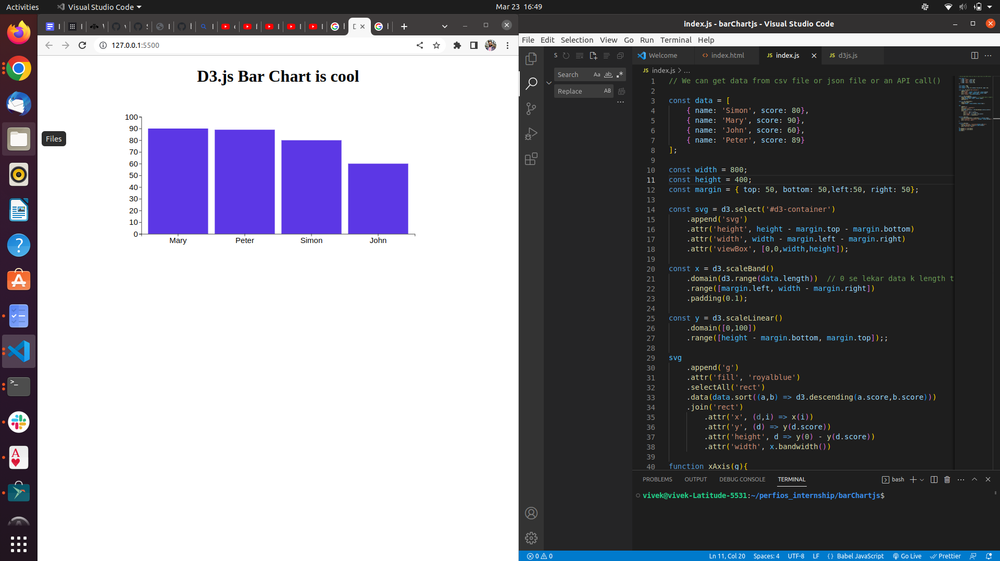
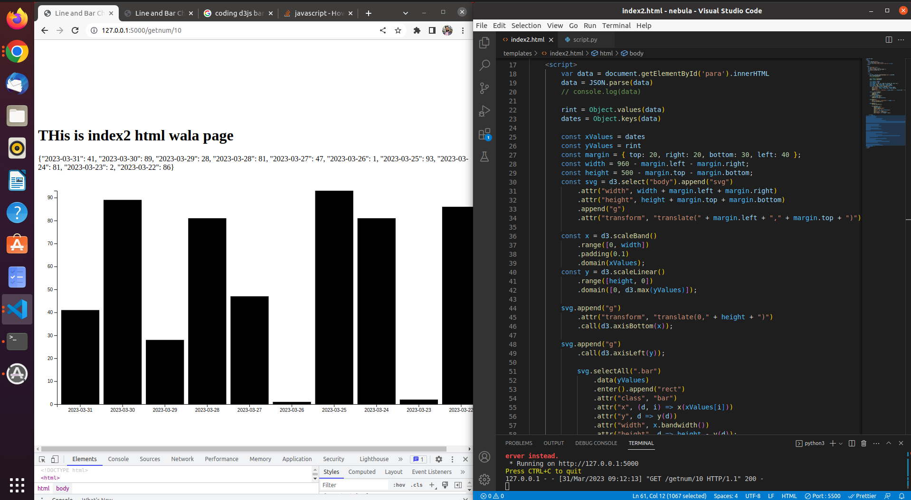

# Internship Diary

>## 27th Feb, 2023
- [x] Learned Markdown Documentation
  - https://daringfireball.net/projects/markdown/
  - https://docs.github.com/en/get-started/writing-on-github/getting-started-with-writing-and-formatting-on-github/basic-writing-and-formatting-syntax
- [x] Made My Resume using the syntax of Markdown Doc.

>## 28th Feb, 2023
On Leave
- [x] Had to go to College for Project Work Review Phase - 1

>## 1st March
- [x] Documented most of the topics which I learnt in Markdown (documentation me jo padha he) in MarkdownDoc.md file.

>## 2nd March
Started Learning UNIX Commands
- adduser
- addgroup
- cat(15 types)
- cd

>## 3rd March(UNIX Commands Continuation)
> Commands 
- chmod
- clear
- cp
- cut
- date
- deluser
- delgroup
- echo
- find
- grep 
- head
- history
- man
- mkdir
- mv
- passwd
- shutdown
- ssh
- scp
- rsync
- ps

>## 6th March(UNIX Commands Continuation and End)
- ps
- rm 
- dir
- tail
- touch 
- uname 
- which

> Git Commands
- add
- checkout
- clone
- commit
- config
- gitignore
- log
- init
- merge
- gitk
- status
- pull

>## 7th March (Git Commands continuation)
- remote
- stash
Mosh Hamedani
1. Introduction
2. What is Git
3. Using git
4. Installing git
5. COnfiguring git
6. Getting help
7. Taking snapshots
8. Initializing a repository
9. Git Workflow
10. Staging files

>## 8th March (Git Continuation)
11. Committing changes
12. Committing Best practices
13. Skipping the staging area
14. Removing files
15. Renaming or Moving files

>## 9th March (Git Completion)
17. Ignoring files
18. Short Status
19. Viewing the Staged and Unstaged changes
20. VIsual Diff Tools
21. Viewing the history
22. Viewing a commit
23. Unstaging files
24. Discarding local changes
25. Restoring a File to an Earlier version

- Started Python Learning

>## 10th March
- Lists
- Dictionaries
- Tuples
-  Set
- Frozen Sets
- String
- Linked List
- deque - stack
- deque - queue
- Binary tree


Modules in Python
- OS [ref link](https://www.geeksforgeeks.org/os-module-python-examples/)
- argparse [ref link](https://www.geeksforgeeks.org/os-module-python-examples/)
- pandas [ref link](https://pandas.pydata.org/docs/)

>## 13th March
- Functions
- Decorators
- Classes and Objects
- Modules
- packages
- libraries
- framework
- Lamda expression

>## 14th March
- Venv
- Error Handling
  
- ## Creating a SSH tunnel
  - SSH tunneling, or SSH port forwarding, is a method of transporting arbitrary data over an encrypted SSH connection. SSH tunnels allow connections made to a local port (that is, to a port on your own desktop) to be forwarded to a remote machine via a secure channel. 

 - Local Port Forwarding 
 - Remote port forwarding
 - Dynamic Port forwarding 

>## task assigned
- Establish connection between 5 machines
- View files and directories after connection
- Transfer files from one machine to another machine 
-------
* All the tasks to be done without password also

>## tasks accomplished
- Using `ssh` to establish connection between different linux machines.
```bash
 sudo apt update
 sudo apt install openssh-server 
```
- Established connection with 'vaibhavraj' user using the below ssh command

```bash
vivek@vivek-Latitude-5531:~$ ssh vaibhavraj@192.168.10.94
The authenticity of host '192.168.10.94 (192.168.10.94)' can't be established.
ECDSA key fingerprint is SHA256:ZqJv9EkLkKPQMlDTCIk6py66cJUV0N3bTc3YJEambn0.
Are you sure you want to continue connecting (yes/no/[fingerprint])? y
Please type 'yes', 'no' or the fingerprint: yes 
Warning: Permanently added '192.168.10.94' (ECDSA) to the list of known hosts.
vaibhavraj@192.168.10.94's password: 
Welcome to Ubuntu 20.04.5 LTS (GNU/Linux 5.14.0-1058-oem x86_64)

 * Documentation:  https://help.ubuntu.com
 * Management:     https://landscape.canonical.com
 * Support:        https://ubuntu.com/advantage

 * Introducing Expanded Security Maintenance for Applications.
   Receive updates to over 25,000 software packages with your
   Ubuntu Pro subscription. Free for personal use.

     https://ubuntu.com/pro

Expanded Security Maintenance for Applications is not enabled.

9 updates can be applied immediately.
6 of these updates are standard security updates.
To see these additional updates run: apt list --upgradable

Enable ESM Apps to receive additional future security updates.
See https://ubuntu.com/esm or run: sudo pro status


The programs included with the Ubuntu system are free software;
the exact distribution terms for each program are described in the
individual files in /usr/share/doc/*/copyright.

Ubuntu comes with ABSOLUTELY NO WARRANTY, to the extent permitted by
applicable law.

vaibhavraj@vaibhavraj-Latitude-5531:~$ ls
abc.txt  Documents  Music     Public  Templates
Desktop  Downloads  Pictures  snap    Videos
vaibhavraj@vaibhavraj-Latitude-5531:~$ whoami
vaibhavraj
```
2.  Transfered files from `vaibhavraj` user *( another machine to my machine)*
```bash
vaibhavraj@vaibhavraj-Latitude-5531:~$ ls
abc.txt  Documents  Music     Public  Templates
Desktop  Downloads  Pictures  snap    Videos
vaibhavraj@vaibhavraj-Latitude-5531:~$ cat abc.txt
gfh hfi
vaibhavraj@vaibhavraj-Latitude-5531:~$ scp abc.txt vivek@192.168.10.104:/home/vivek/perfios_internship
vivek@192.168.10.104's password: 
abc.txt                                       100%    8     0.6KB/s   00:00    
vaibhavraj@vaibhavraj-Latitude-5531:~$ 
```

3. Transfering files to a **destination path** (my machine to another machine)
```bash
vivek@vivek-Latitude-5531:~/perfios_internship$ scp file@vivek.txt vaibhavraj@192.168.10.94:/home/vaibhavraj/Downloads
vaibhavraj@192.168.10.94's password: 
file@vivek.txt                                100%    0     0.0KB/s   00:00   
```
# Remote Log In (W/O Password)
4. Establishing **SSH** connection between 5 machines.
  - Create a guest account in all machines with same passwords.
  ```bash
  vivek@vivek-Latitude-5531:~$ sudo adduser guest
  ```
  ```bash
  guest@vivek-Latitude-5531:~$ ssh guest@192.168.10.94
The authenticity of host '192.168.10.94 (192.168.10.94)' can't be established.
ECDSA key fingerprint is SHA256:ZqJv9EkLkKPQMlDTCIk6py66cJUV0N3bTc3YJEambn0.
Are you sure you want to continue connecting (yes/no/[fingerprint])? yes
Warning: Permanently added '192.168.10.94' (ECDSA) to the list of known hosts.
guest@192.168.10.94's password: 
Welcome to Ubuntu 20.04.5 LTS (GNU/Linux 5.14.0-1058-oem x86_64)

  ```
  - Logging into the Guest account has three steps/ commmands to be executed :-

  ```bash
  guest@vivek-Latitude-5531:/home/vivek$ ssh-keygen -b 4096
  The key's randomart image is:
+---[RSA 4096]----+
|                 |
|       . o       |
|        + o      |
|       +   .     |
|      . S .      |
|    .o.+.O o     |
|    oo=+=o*      |
|  . .XB*E+       |
|   +OX%Ooo       |
+----[SHA256]-----+
  ```
  ```bash
  guest@vivek-Latitude-5531:~$ ssh-copy-id guest@192.168.10.94
/usr/bin/ssh-copy-id: INFO: Source of key(s) to be installed: "/home/guest/.ssh/id_rsa.pub"
/usr/bin/ssh-copy-id: INFO: attempting to log in with the new key(s), to filter out any that are already installed
/usr/bin/ssh-copy-id: INFO: 1 key(s) remain to be installed -- if you are prompted now it is to install the new key
  ```
  Logging in :-
  ```bash
  guest@vivek-Latitude-5531:~$ ssh guest@192.168.10.94

  ```
  Viewing and Transferring files in another account( guest )
  ```bash
  guest@vaibhavraj-Latitude-5531:~$ ls
guest@vaibhavraj-Latitude-5531:~$ touch abc.txtx
guest@vaibhavraj-Latitude-5531:~$ ls
abc.txtx
guest@vaibhavraj-Latitude-5531:~$ ls
abc.txtx
guest@vaibhavraj-Latitude-5531:~$ ls
abc.txtx
guest@vaibhavraj-Latitude-5531:~$ echo "Vivek's file" > file.txt
guest@vaibhavraj-Latitude-5531:~$ ls
abc.txtx  file.txt
guest@vaibhavraj-Latitude-5531:~$ 
```
## Task Done!!!

>## March 15

v- Problem Statements discussed with Snigdha and teammates

1.  - Ansible for Deployment 
    - Output of Ansible script provided by Athena
    -  Understand the output looking like
    - Code - extract karke pdf report
    - Pdf report
    - Data avail for ops team (any changes being made ) through Ops team.
----------------
2. - Metrics-
      - Uptime (Devops team worked on)
      - Downtime
      - Capactiy
      - App - req, n/w, throughput , income and outgoing req etc

- Making sense - Grapgh (bar, line,gauge etc)
- Elastic search 
- Python - plotly
- Prometheus Graphana 
- D3JS -  JS Library
Inputs in diff file format
Framework`
Automated, monthly wise, date range (All in graphs)
-----------------
### Explored:-
1. **D3JS**
2. **ANsible**
--------
Both have Python has a base

>## March 16

#### Ansible Script :-

- An Ansible script is a set of instructions written in **YAML format** that defines the tasks to be executed by _Ansible on one or more remote hosts_. 
- These scripts are called playbooks and they allow administrators to automate the configuration and deployment of software and infrastructure across multiple servers.

<!-- [1][2][3][4][5]. -->
- Ansible playbooks consist of a series of tasks, each of which defines an action to be taken on a remote host.
- For example, a task might install a package, create a user account, or modify a configuration file. Playbooks can also include variables, loops, conditionals, and other constructs that allow for complex logic and customization.

Here is an example of an Ansible playbook that installs Apache web server on multiple hosts:

```bash
- name: Install Apache web server
  hosts: webservers
  become: true

  tasks:
    - name: Install Apache package
      apt:
        name: apache2
        state: present

    - name: Start Apache service
      systemd:
        name: apache2.service
        state: started
```

In this example, the playbook has two tasks. The first task installs the apache2 package using the apt module.

Project Name : **Secura**
--------------------
CIS Compliance report based on Ansible Dry Run Output.Parse the output of the Ansible Dry Run/Check of CIS Ansible scripts run for one or many hosts and generate a report based on current server setup and whether any changes are to be made or not. 

>## Process

- 
  - To generate a CIS compliance report for a dry run of CIS Ansible scripts, you can use the ```--check``` flag with the ansible-playbook command. This flag performs a dry run of the playbook and reports any changes that would be made without actually making them.
Here's an example command to generate a CIS compliance report for a dry run of Ansible scripts:

```bash
ansible-playbook <Our Ansible playbook file> --check
```

  - This command will perform a dry run of the playbook and report any changes that would be made if it were run normally.
To generate a more detailed compliance report, we can use _**Ansible Tower**_ or other third-party tools that provide reporting capabilities. These tools can provide _detailed reports_ on **compliance status, including which rules are passing or failing**, and what remediation steps are required to bring systems into compliance.
  - It's important to note that while Ansible can help automate many aspects of IT compliance, it is not a silver bullet. Compliance is an ongoing process that requires continuous monitoring and remediation efforts to ensure systems remain secure and compliant over time[3].

>### Research
- _**Cis Compliance Report**_
  - _**CIS compliance**_ refers to **meeting the security standards set by the Center for Internet Security (CIS) benchmarks**. These benchmarks are internationally recognized as security standards for _defending IT systems and data against cyberattacks_. The CIS Benchmarks are prescriptive configuration recommendations for more than 25+ vendor product families, representing a consensus-based effort of cybersecurity experts. They provide **detailed configuration recommendations** for _strengthening specific systems, network devices, and applications_.
- _**Ansible Dry Run**_
  - _**What is Ansible Dry Run?**_
    - Ansible dry run, also known as **check mode**, is a feature that _**allows you to execute an Ansible playbook without actually making changes on the server**_. This enables users to see _what changes would be made if the playbook were run normally_. The easiest way to do a dry run in Ansible is **to use the check mode**, which works like the 
    ```--syntax-check``` command but on a playbook level. When ansible-playbook is executed with ```--check```, _**it will not make any changes on remote hosts and instead shows what changes would have been made**_.
  - _**How to parse the output of Ansible Dry Run?**_
    - Parsing the output of an Ansible dry run can be done using various methods:-
      -  Use the **ansible.utils** collection version 1.0.0 or later, which includes the **cli_parse module** that can run CLI commands and parse semi-structured text output[1]. Another way is to use the check mode, which works like the --syntax-check command but on a playbook level[2]. Additionally, parsing API call's output in Ansible can be done by using JSON output[3]. There are also scripts available on platforms like GitHub that wrap ansible-review and post-process the output to make it easier to parse[4]. The method used for parsing the output depends on the specific requirements of each situation.

  - Elastic Stack:-
    - **Elastic Search**
      - _**Elastic search**_ is a fast and scalable search and analytics engine that is at the heart of the _Elastic Stack_. 
      - It is a modern search and analytics engine based on **Apache Lucene**, which provides a distributed, multitenant-capable full-text search engine with an **HTTP web interface and schema-free JSON documents**.
      - Elasticsearch is completely open source and has quickly become the most popular distributed search engine in use today. It can be used to store, search, and analyze large volumes of data in real-time.
      - Elasticsearch is often used for log analysis, full-text search, security analytics, business analytics, and operational intelligence.
    - **Log Stash**
      - _**Logstash**_  is a free and open server-side data processing pipeline that _ingests data from a multitude of sources, transforms it, and then sends it to your desired destination._ 
      - It is part of the Elastic Stack along with _**Beats, Elasticsearch, and Kibana**_. 
      - _**Logstash**_ is responsible for aggregating data from different sources and is often used as the _"L" in the ELK Stack_, which is the **world's most popular log analysis platform.** 
      - _**Logstash**_ can be _used for managing events and logs by collecting, processing, and storing them in a centralized location._
      - It has input and output configurations that can be customized to meet specific requirements.
    - **Kibana**
      - _**Kibana**_  is a visual interface tool that allows users to explore, visualize, and build a dashboard over the log data massed in Elasticsearch Clusters. 
      - It is part of the Elastic Stack and _can be used for data analytics at speed and scale for observability, security, and search._
      - Kibana provides powerful analysis on any data from any source, including threat detection, application monitoring, and operational intelligence.
      - It is often used to _**visualize trends in log data and metrics**_ alongside other tools like **Grafana**. 
      - Kibana sits at the top of the Elastic Stack and allows users to search and visualize the data stored in Elasticsearch clusters.
      - With Kibana, users can create visualizations and add them to dashboards for easy access to important information.

>## 17th March (Research)
Project Name : **Nebula**
------------------------------
Coverage of different variations of _**Devops Metrics**_(uptime, capacity etc) using D3.JS visualisations. 

>### Research
- **Process**
  - _**D3.js**_ is a JavaScript library that can be used to create interactive and dynamic data visualizations on the web. 
  - To plot different DevOps metrics like uptime, downtime, and capacity using D3.js visualizations, users can first collect the relevant data using tools like LogicMonitor or Dynatrace!.
  [1](https://www.logicmonitor.com/support/devices/adding-managing-devices/graphs-tab-device-dashboards)
  [2](https://www.dynatrace.com/news/tag/lifecycle-devops/feed/)
  - Once the data has been collected, it can be processed and transformed into a format that can be used by D3.js.
  - Users can then use D3.js to create custom visualizations that display the relevant metrics in an interactive and dynamic way. 
  [3](https://itjumpstart.files.wordpress.com/2019/09/theartofmonitoring.pdf)
  - The specific type of visualization used will depend on the specific requirements of each situation. 
  - For example, line charts or bar charts could be used to display uptime and downtime metrics over time, while scatter plots could be used to show correlations between different metrics such as capacity and response time.
  [4](https://www.altexsoft.com/blog/devops-metrics/)

- _**What is d3.js and How does it work ?**_
  - D3.js is an open-source JavaScript library that allows users to create custom interactive data visualizations in the web browser
  [1](https://website.education.wisc.edu/~swu28/d3t/)
  [2](https://www.tutorialsteacher.com/d3js/what-is-d3js)
  - It stands for Data-Driven Documents and was developed by Mike Bostock[2]. 
  - D3.js works by binding arbitrary data to a Document Object Model (DOM) and then applying data-driven transformations to the document
  [3](https://d3js.org/) 
  - This allows users to manipulate, change, or add to the DOM based on the data being visualized. D3.js uses HTML, CSS, and SVG to create visual representations of data[4](https://www.freecodecamp.org/news/learn-d3-js-in-5-minutes-c5ec29fb0725/) 
  - Users can create a wide range of visualizations using D3.js, including line charts, bar charts, scatter plots, and more. The library provides a powerful set of tools for working with data in the browser and creating dynamic and interactive visualizations that can be used for a variety of applications.[5](https://www.tutorialspoint.com/d3js/d3js_introduction.htm)

  - _Uptime_ :-
   - Uptime refers to the amount of time that a system or service is available and operational.
   - It is often used as a measure of reliability and can be expressed as a percentage of total time[link](https://englishwithkim.com/clarifying-confirming-understanding/).
   - For example, if a system has an uptime of 99%, it means that it was available and operational for 99% of the total time it was supposed to be running.
   - Uptime is an important metric for many systems, particularly those that are critical to business operations or customer experience.
   - It can be monitored using various tools and techniques, including network monitoring software, log analysis, and performance testing[link](https://textcortex.com/post/how-to-rephrase-question-into-a-sentence).
   - By monitoring uptime, organizations can identify potential issues before they become major problems and take steps to improve the reliability and availability of their systems[link](https://www.indeed.com/career-advice/interviewing/respond-to-questions).
_
  - _Downtime_ and _Network Capacity_:-
    - Downtime and network capacity are important metrics for measuring the success of DevOps practices. Downtime refers to the amount of time that a system or service is unavailable or not operational[link](https://www.appdynamics.com/topics/devops-metrics-and-kpis)[link](https://www.alibabacloud.com/blog/devops-how-to-have-less-downtime_594973).
    - It can be measured using various tools and techniques, including network monitoring software, log analysis, and performance testing. Network capacity refers to the maximum amount of data that can be transmitted over a network in a given period of time[link](https://cloud.google.com/architecture/devops/devops-measurement-wip-limits).
    - It is an important metric for ensuring that systems can handle the expected load and traffic.
    - Network capacity can be monitored using tools like load testing software and network traffic analysis tools[link](https://phoenixnap.com/blog/devops-metrics-kpis).
    - By monitoring downtime and network capacity, organizations can identify potential issues before they become major problems and take steps to improve the reliability and availability of their systems[link](https://www.dynatrace.com/news/blog/devops-metrics-for-success/).

    --------------------
    >## 20th March

    >### Project 3 - Write Ansible scripts to harden a server based on CIS benchmarks (Cyber Security)

    ### _**Research :-**_

    #### _Hardening a Server_ :-

    - Hardening a server involves implementing security measures to reduce the risk of vulnerabilities and attacks. 
    - One way to harden a server is by using the CIS benchmarks, which provide guidelines for securing various operating systems and applications. 
    - Ansible can be used to automate the process of hardening servers based on these benchmarks[1][2][3][4][5].
    - To harden a server using Ansible, we can create an Ansible playbook that includes tasks for each benchmark item. For example, we can use the cis_security role from Ansible Galaxy to apply the CIS benchmarks to our servers:
        
    ```bash
    - name: Harden servers with CIS benchmarks
      hosts: all
      become: true

      roles:
        - cis_security
    ```

    - This playbook applies the **cis_security** role to all hosts and uses become to run tasks as root. The **cis_security** role includes tasks for applying various security controls based on the _CIS benchmarks_.
    - Other tasks that can be included in a hardening playbook include configuring firewalls, _**enabling SELinux or AppArmor**_, disabling unnecessary services, setting password policies, and more. By automating these tasks with Ansible, we can ensure that our servers are consistently hardened and reduce the risk of vulnerabilities and attacks.
    - In summary, hardening a server involves implementing security measures to reduce the risk of vulnerabilities and attacks. Using the CIS benchmarks and Ansible can help automate this process by providing guidelines for securing servers and automating the implementation of security controls.


    ### _Benefits of hardening a Server :-_
    - Using Ansible for server hardening has several benefits. Firstly, it allows for the creation of a known-good configuration for all servers in an environment, which helps to enforce a consistent security posture and reduce the risk of vulnerabilities[1]. 
    - Secondly, Ansible uses SSH for communications, which is a more secure method as the traffic is encrypted[2].
    - Thirdly, Ansible can automate the process of hardening servers by executing tasks across multiple hosts simultaneously, saving time and effort[3].
    - Fourthly, Ansible's Playbook syntax allows for easy definition of secure configurations for different parts of a system[4].
    - Finally, using Ansible can help organizations achieve compliance with security standards such as CIS benchmarks or HIPAA by automating the implementation of security controls[1][4].

    - In summary, using Ansible for server hardening provides several benefits including consistent security posture enforcement, secure communication via SSH, automation of hardening tasks across multiple hosts, easy definition of secure configurations using Playbooks and compliance with security standards.

    #### _To harden a server based on CIS benchmarks using Ansible, we can create an Ansible playbook that includes tasks for each benchmark item. The following is an example of how to use Ansible to harden a newly-deployed Ubuntu 20.04 server based on the CIS Ubuntu Linux 20.04 LTS Benchmark[1]:_
```bash
  name: Harden Ubuntu 20.04 Server
  hosts: all
  become: true
  tasks:
    - name: Install auditd package
      apt:
        name: auditd
        state: present
    - name: Configure auditd rules
      copy:
        src: files/audit.rules
        dest: /etc/audit/rules.d/audit.rules
        owner: root
        group: root
        mode: '0640'
    - name: Enable auditd service
      systemd:
        name: auditd.service
        enabled: yes
    - name: Set password policy for users
      pam_limits:
        domain: 'all'
        limit_type: 'hard'
        limit_item: 'max_pass_age'
        value: '90'
    - name: Disable root login via SSH
      lineinfile:
        path
```
  #### CIS Benchmarks -

  - A collection of best practices for securely configuring IT systems, software, networks, and cloud infrastructure. 
  
  #### Why Ansible scripts are used for server hardening ?

  - Ansible scripts are used to harden servers because they provide a simple and efficient way to automate the process of implementing security controls.
  - Ansible is a configuration management tool that allows administrators to define and manage the configuration of multiple servers from a single location.
  - By using Ansible, administrators can ensure that all servers in their environment are configured consistently and securely.
  
  <!-- [1][2][3]. -->

  - Ansible uses SSH for communication between the control node and managed nodes, which provides an encrypted method of communication that is more secure than other methods[2]. This makes it an ideal tool for implementing security controls on servers.

  - Ansible also provides a simple syntax for defining tasks and roles, which makes it easy to create playbooks that implement security controls such as firewall rules, SELinux policies, password policies, and more[4]. 
  - Playbooks can be easily customized to meet specific security requirements or compliance standards.

  In summary, Ansible scripts are used to harden servers because they provide an efficient way to automate the process of implementing security controls. Ansible's use of SSH for communication and its simple syntax for defining tasks make it an ideal tool for implementing security controls on servers.

  >### 21st March

  >### 23rd March

  <!-- - Started Exploring D3.js
  [YT link](https://www.youtube.com/watch?v=C4t6qfHZ6Tw) -->
  - Making a bar chart graph
  [YT link](https://www.youtube.com/watch?v=BDpBAFvdjYo)
  
  Tried Experimenting this On my Local system
  - Bar Chart JS
  **(HTML, JS)**
  

  >### 24th March

  Learned Basics of D3.JS
  <!-- - Started ~[D3.js tutorial ](https://www.youtube.com/playlist?list=PL6il2r9i3BqH9PmbOf5wA5E1wOG3FT22p) -->
  
  >### 27th March
  - Project Assigned
    - Nebula
  - Tried to learn javascript , html

  >## 28th March'
  - Started the Task (Snigdha)
  - Task - 
    - Python Script se random numnbers ayega
    - Using HTML and JS  

  >## 29th March
  - **Error** faced - Was not able to send data from python (flask / fastAPI)
  - Tried different ways to resolve:-
    - Used /*node*/ require module, request module , exporting variables from one module to another 
    - tried FastAPI Python code(TemplateResponse from Templates library didn't work properly as in Accessing the data of python in HTML was not possible)
  - From FastAPI python script, we used json.dumps(), templates module/library to get from python script to the html file  
  
  >## 30th March
  - Found the solution for yesterday's problem
    - Implemented everything in Flask micro framework of Python whatever code was written in FastAPI
    - Used render_template method to render html files as pass on data(variables) from .py file to templates.html file(dict = my_dict)
    - Accessed {{ dict }}  from html page
      - scrapped the `<p>` tag 
      - Used JSON.parse() to convert into json object
      - Converted json object to 2 arrays for x axis and y axis
    
    - Constructed and coded a Bar graph
    


    >## 31st March
    - **Before Adding The Drop Down Menu**
    - First, we define two arrays of data: ***xValues and yValues***. These arrays contain the x-axis and y-axis values for the charts, respectively.

      - Next, we define some variables for the chart dimensions and margins, and create two SVG elements using the ***d3.select()*** and  ***append() functions***.
      - For the bar chart, we create a ***band scale*** for the x-axis using ***d3.scaleBand()***, and a ***linear scale*** for the y-axis using ***d3.scaleLinear()***. We then create the ***x-axis and y-axis using d3.axisBottom() and d3.axisLeft()***, respectively, and ***append them to the SVG element using the call() function***. Finally, we ***create a rect element for each data point using the selectAll() and data() functions***, and ***set the attributes of the rect elements using the attr() function***.

      - For the line chart, we create a band scale for the x-axis and a linear scale for the y-axis, just like in the bar chart. We then ***create a line generator using d3.line()***, and ***set the x and y values using the x() and y() functions***, respectively. We ***append the x-axis and y-axis to the SVG element***, and ***create a path element for the line using the append()*** function. We set the attributes of the ***path element using the attr()*** function, and ***bind the data to the element using the datum() ***function.

    - **After Adding the Drop Down Menu**
      - I provided the code for displaying a bar chart or a line chart based on the user's selection from a dropdown menu. The HTML code includes a select element with two options for the chart type, a button element to trigger the chart drawing function, and a div element to display the chart. The JavaScript code defines the drawChart() function that gets the selected chart type and the data arrays, sets the chart dimensions and margins, creates an SVG element, and generates the chart based on the selected type.
      
      - For the bar chart, the code uses the d3.scaleBand() function to create a band scale for the x-axis, and the d3.scaleLinear() function to create a linear scale for the y-axis. It then creates the x-axis and y-axis using the d3.axisBottom() and d3.axisLeft() functions, respectively, and appends them to the SVG element using the call() function. Finally, it creates a rect element for each data point using the selectAll() and data() functions, and sets the attributes of the rect elements using the attr() function.

      - For the line chart, the code uses the same scales and axes as the bar chart, but creates a line generator using the d3.line() function instead of rect elements. It sets the x and y values of the line using the x() and y() functions, respectively, and appends the line to the SVG element using the append() function.

* Overall, the code uses the d3 library to create and manipulate SVG elements, scales, and axes, and to generate the bar and line charts from the input data. The code also demonstrates how to get the selected chart type from a dropdown menu and how to trigger the chart drawing function using a button click event.

>## April 3rd, 2023
- This is the Output of the yesterday's Changes

 

- Referring [freecodecamp d3.js link](https://www.freecodecamp.org/news/d3js-tutorial-data-visualization-for-beginners/#getting-started) for learning the different kinds of attributes, featuires and functionalities.


**Vivek**
/** **/